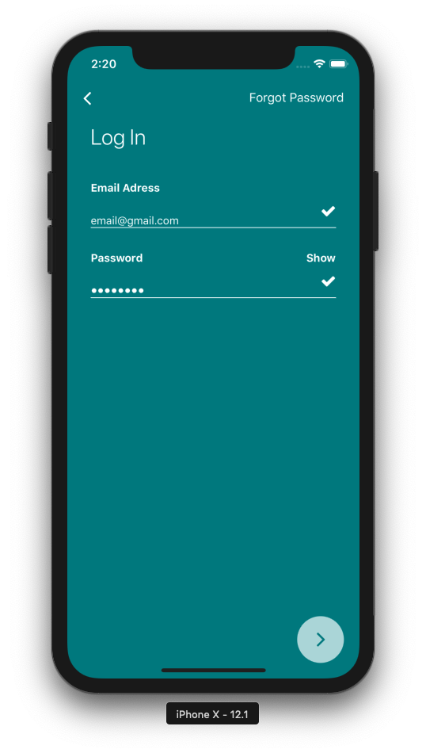
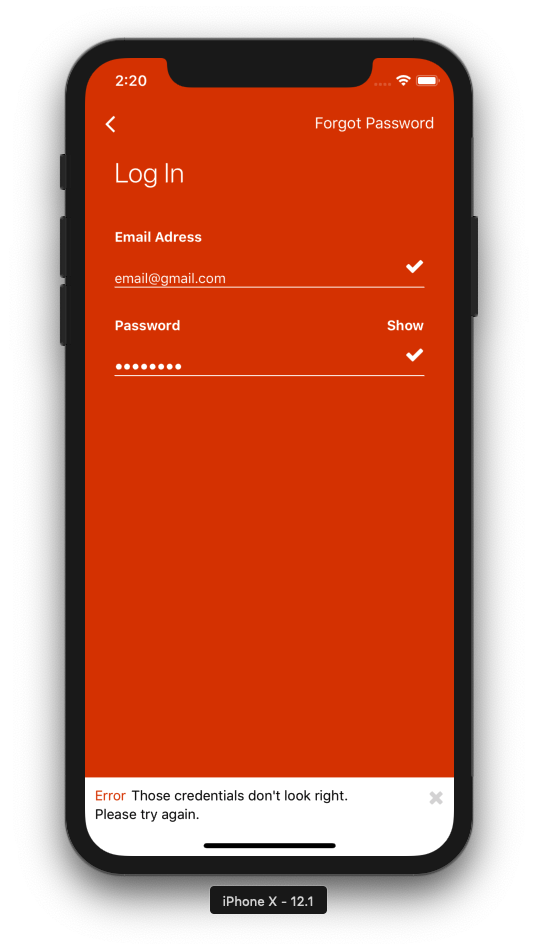
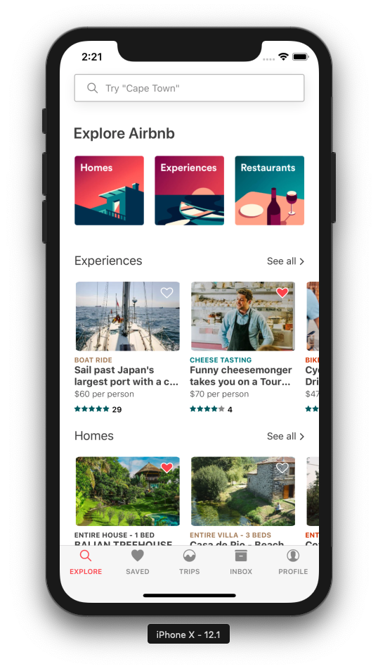
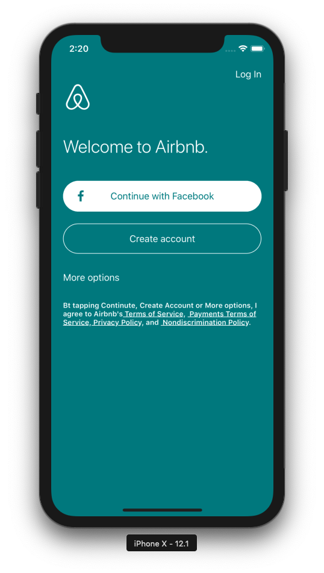
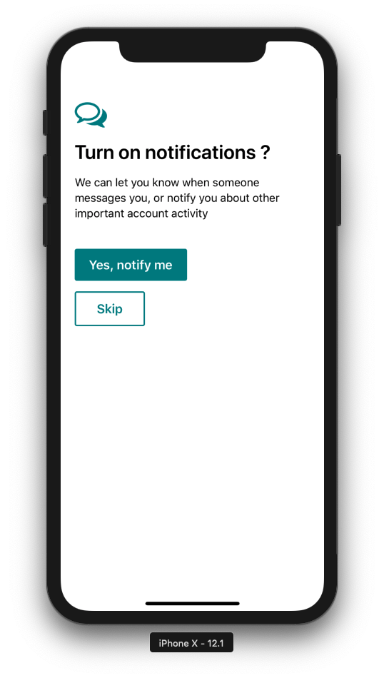
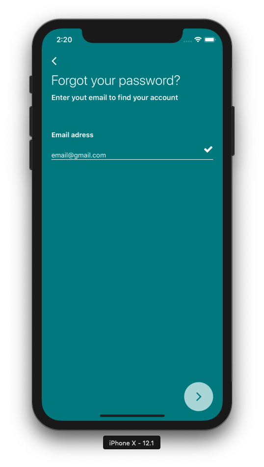
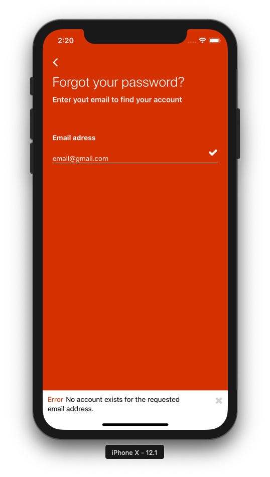

# airbnb-clone
  <li>dasda<li>

Mobile app clone of 'airbnb' (React Native/GraphQL/Apollo)

TODO: GraphQL Server

<ul>
  <li>dasda<li>
  <li>dasda<li>
  <li>dasda<li>
 </ul>
<table>
  <tr>
    <td></td>
    <td></td>
    <td></td>
    <td></td>
  <tr>
  <tr>
    <td></td>
    <td></td>
    <td></td>
  <tr>
</table>

